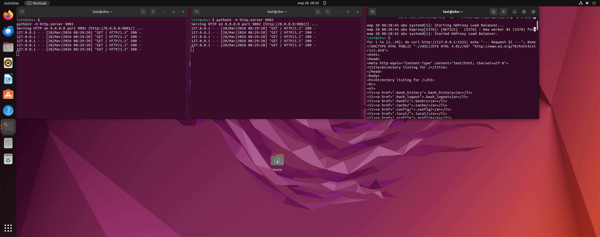
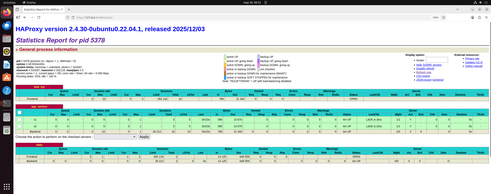
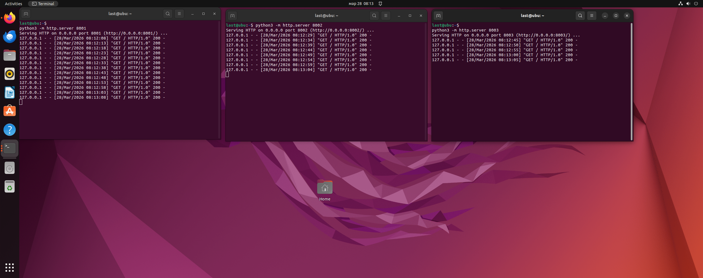
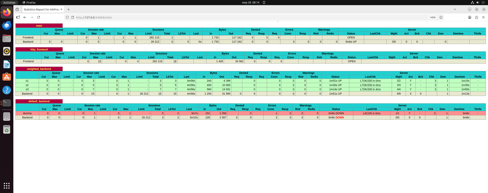
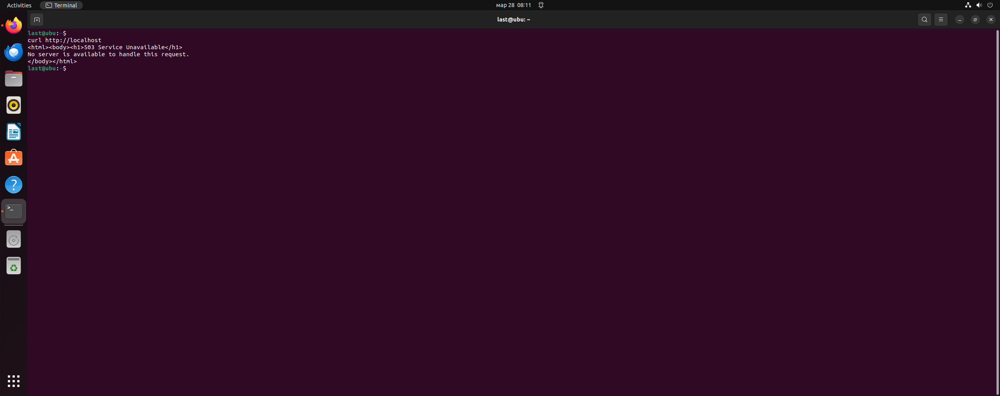

# Домашнее задание к занятию 2 «Кластеризация и балансировка нагрузки» - Ластухин Никита Sys-55


### Задание 1
Запустите два simple python сервера на своей виртуальной машине на разных портах
Установите и настройте HAProxy, воспользуйтесь материалами к лекции по ссылке
Настройте балансировку Round-robin на 4 уровне.
На проверку направьте конфигурационный файл haproxy, скриншоты, где видно перенаправление запросов на разные серверы при обращении к HAProxy.


[Конфигурация HAProxy для задачи 1](https://github.com/mra4niiraspad-a11y/sys-55-lastuhin/blob/main/configs/haproxy-Task1)




---

### Задание 2
Запустите три simple python сервера на своей виртуальной машине на разных портах
Настройте балансировку Weighted Round Robin на 7 уровне, чтобы первый сервер имел вес 2, второй - 3, а третий - 4
HAproxy должен балансировать только тот http-трафик, который адресован домену example.local
На проверку направьте конфигурационный файл haproxy, скриншоты, где видно перенаправление запросов на разные серверы при обращении к HAProxy c использованием домена example.local и без него.


```
global
    log /dev/log local0
    log /dev/log local1 notice
    chroot /var/lib/haproxy
    stats socket /run/haproxy/admin.sock mode 660 level admin expose-fd listeners
    stats timeout 30s
    user haproxy
    group haproxy
    daemon

defaults
    log global
    mode http
    option httplog
    option dontlognull
    timeout connect 5000
    timeout client 50000
    timeout server 50000

listen stats
    bind :8889
    mode http
    stats enable
    stats uri /stats
    stats refresh 5s
    stats realm Haproxy\ Statistics
    stats auth admin:password

frontend web_frontend
    bind :80
    acl host_example hdr(host) -i example.local
    use_backend weighted_servers if host_example
    default_backend no_balancing

backend weighted_servers
    mode http
    balance weight roundrobin
    option httpchk GET /
    server s1 127.0.0.1:8888 weight 2 check
    server s2 127.0.0.1:9999 weight 3 check
    server s3 127.0.0.1:7777 weight 4 check

backend no_balancing
    mode http
    errorfile 503 /etc/haproxy/errors/503.http


```



---

