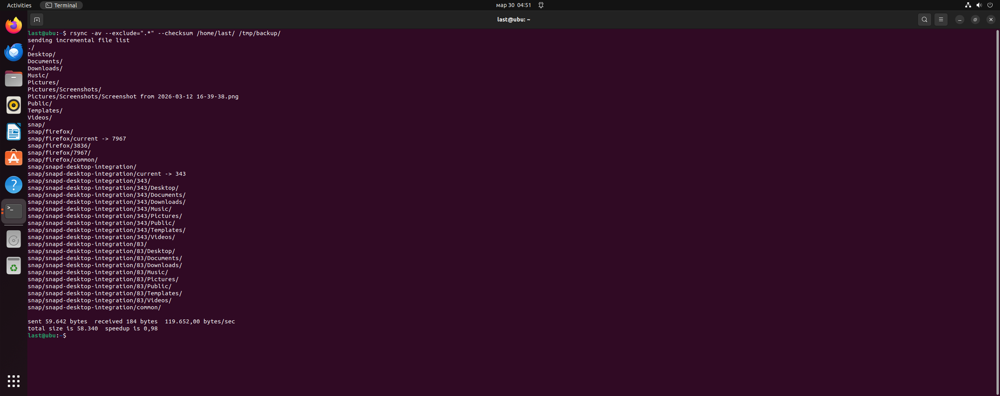
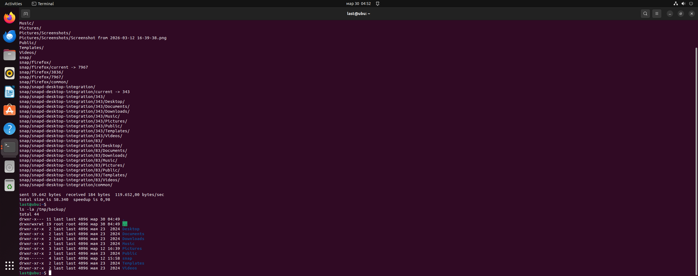
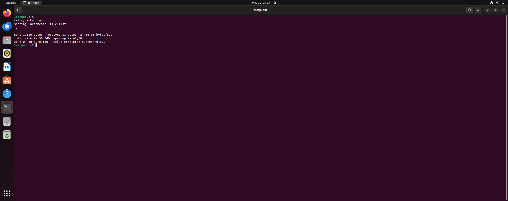
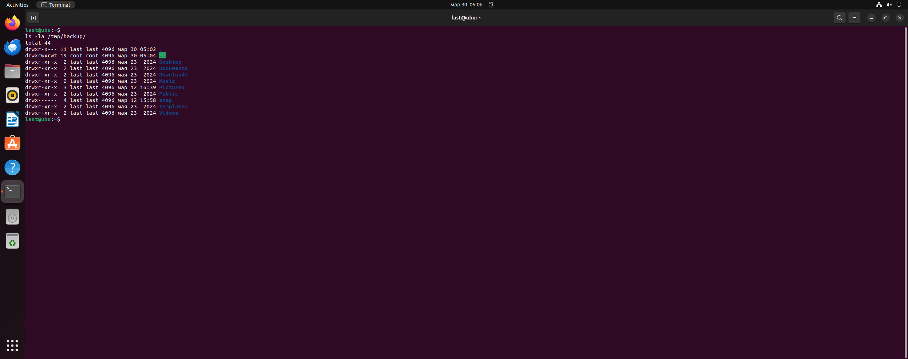

# Домашнее задание к занятию 3 «Резервное копирование» - Ластухин Никита Sys-55

### Задание 1
Составьте команду rsync, которая позволяет создавать зеркальную копию домашней директории пользователя в директорию /tmp/backup
Необходимо исключить из синхронизации все директории, начинающиеся с точки (скрытые)
Необходимо сделать так, чтобы rsync подсчитывал хэш-суммы для всех файлов, даже если их время модификации и размер идентичны в источнике и приемнике.
На проверку направить скриншот с командой и результатом ее выполнения

---
rsync -av --exclude=".*" --checksum /home/last/ /tmp/backup/

---

---

### Задание 2
Написать скрипт и настроить задачу на регулярное резервное копирование домашней директории пользователя с помощью rsync и cron.
Резервная копия должна быть полностью зеркальной
Резервная копия должна создаваться раз в день, в системном логе должна появляться запись об успешном или неуспешном выполнении операции
Резервная копия размещается локально, в директории /tmp/backup
На проверку направить файл crontab и скриншот с результатом работы утилиты.

[Скрипт](https://github.com/mra4niiraspad-a11y/sys-55-lastuhin/blob/a07ed7f5c3472c7a4eaf9417e251c8bf7096d7cf/%D0%A1%D0%BA%D1%80%D0%B8%D0%BF%D1%82)
[Содержимое файла](https://github.com/mra4niiraspad-a11y/sys-55-lastuhin/blob/18c3f7995bc6848308ff7880e01c36bac59d57f3/crontab_file.txt)

---

